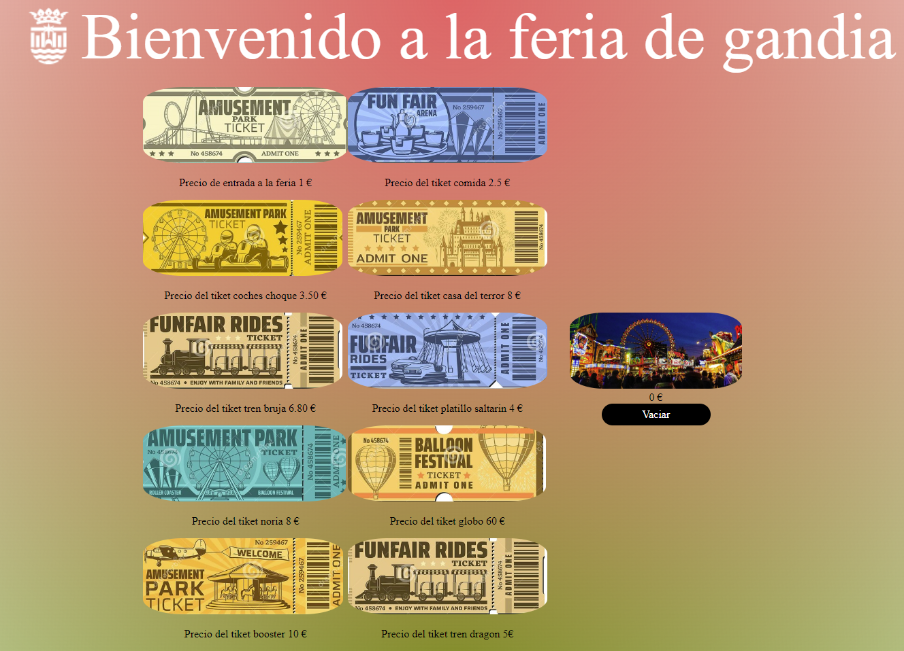

# Proyecto *DRAG and DROP* con *JSVanilla*.
El proyecto realizado como **prueba final del curso realizado en *URBALAB* Gandía** se basaba de hacer una aplicación con los **eventos de drag y drop.**

## Funcionamiento de la aplicación.
Esta pequeña aplicación se basa en poder **arrastrar las imágenes** que están declaradas como objetos dentro del JS con unos valores fijos, al arrastrarlos hasta la imagen que hay a la derecha (el carrito) se iniciará un contador con *el valor del ticket y el tiempo* que pasas en la atracción de todos elementos arrastrados hasta la imagen del carrito.

**Al apretar el botón de "Vaciar"** se pondrán todos los contadores a 0 y podrás iniciarlo de nuevo.

Al hacer una **compra superior a 100€ se notificará una alerta** avisando de que se va a pasar de los 100€. 

## Tecnologías usadas.
Para la creación de este pequeño proyecto he usado las tecnologías:
- **JavaScript.**
- **HTML 5**
- **CSS**

### Duración del proyecto.
Este proyecto se empezó el 21 de Septiembre y se terminó  el 29 de Septiembre.

## Bugs conocidos de la aplicación
Al intentar hacer una compra de un ticket cuando ha salido la alerta por primera vez, al intentar volver a comprar vuelve a salir la alerta.
Si intentas seleccionar varios tickets no se implementan a la misma vez.
Si la pantalla es menor a 1300px el encabezado se desplaza y hace que todo se descuadre.

## Futuros cambios.
Me gustaría poder implementar un selector de la cantidad de tickets que puede la gente comprar.
Poder borrar los tickets por error arrastrados.
Mejorar el diseño y realizarlo adaptable a todos los dispositivos.
Implementar una forma de poder imprimir los tickets que la gente quiera comprar. 

# Info y contacto

Soy un pequeño programador con unas ganas inmensas de poder crear y mejorar en este gran mundo.

Puedes ponerte en contracto conmigo en ...

GMAIL : martin.kiri98@gmail.com

Sigueme en mi GITHUB para poder ver mis proyectos.

https://github.com/MartinKiri